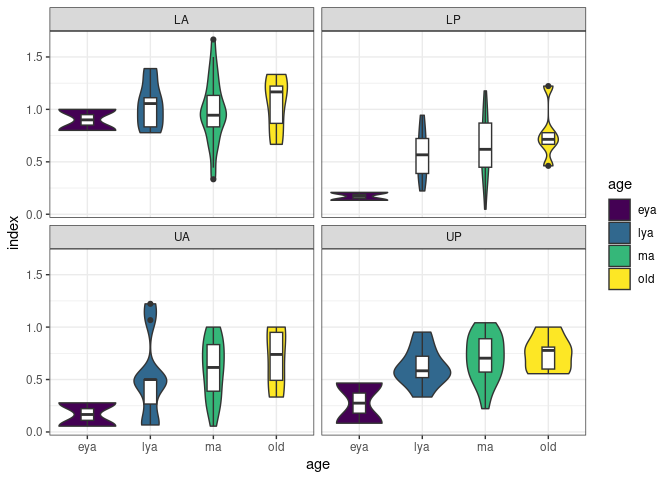

<!-- README.md is generated from README.Rmd. Please edit that file -->

# teethr 

<!-- badges: start -->

[](https://github.com/bbartholdy/teethr/actions/workflows/R-CMD-check.yaml)
<!-- badges: end -->

⚠️ **VERY early development!** ⚠️

The goal of teethr (pronounced teether) is to provide a set of tools to
calculate dental indices, such as caries ratio, and calculus index, and
facilitate visualisation of data related to dental diseases.

## Installation

You can install the development version of teethr like so:

``` r
devtools::install_github("bbartholdy/teethr")
```

## Examples

### Tidy dental data

First, dental data are combined with demographic data and converted to
long format with `dental_longer()`. `dental_longer()` also adds
information on tooth type and position that can be used to calculate
tooth- and position-specific indices.

``` r
library(teethr)
library(dplyr)

mb11_calculus_long <- mb11_calculus %>% 
  dental_longer(-id, names_sep = "_") %>% # make longer all columns except 'id'
  dental_join() # add tooth information (position, type, etc.)
  inner_join(mb11_demography, by = "id") # combine with age and sex
mb11_calculus_long
```

    #> Joining with `by = join_by(tooth)`
    #> # A tibble: 3,936 × 12
    #>    id    tooth surface score region  position  side  class  type  quadrant age  
    #>    <chr> <chr> <chr>   <dbl> <chr>   <chr>     <chr> <chr>  <chr> <chr>    <chr>
    #>  1 MB131 11    bucc        0 maxilla anterior  right incis… i1    UA       ma   
    #>  2 MB131 11    lin         0 maxilla anterior  right incis… i1    UA       ma   
    #>  3 MB131 11    ip          1 maxilla anterior  right incis… i1    UA       ma   
    #>  4 MB131 12    bucc        0 maxilla anterior  right incis… i2    UA       ma   
    #>  5 MB131 12    lin         0 maxilla anterior  right incis… i2    UA       ma   
    #>  6 MB131 12    ip          1 maxilla anterior  right incis… i2    UA       ma   
    #>  7 MB131 13    bucc        0 maxilla anterior  right canine c     UA       ma   
    #>  8 MB131 13    lin         0 maxilla anterior  right canine c     UA       ma   
    #>  9 MB131 13    ip          0 maxilla anterior  right canine c     UA       ma   
    #> 10 MB131 14    bucc        1 maxilla posterior right premo… pm1   UP       ma   
    #> # ℹ 3,926 more rows
    #> # ℹ 1 more variable: sex <chr>

If you need to switch between tooth notations, you can use
`dental_recode()`. Currently available notations are FDI, Standards, and
text.

``` r
mb11_calculus_long %>%
  dental_recode(col = tooth, from = "FDI", to = "text") %>%
  select(id, tooth)
#> # A tibble: 3,936 × 2
#>    id    tooth
#>    <chr> <chr>
#>  1 MB131 URI1 
#>  2 MB131 URI1 
#>  3 MB131 URI1 
#>  4 MB131 URI2 
#>  5 MB131 URI2 
#>  6 MB131 URI2 
#>  7 MB131 URC1 
#>  8 MB131 URC1 
#>  9 MB131 URC1 
#> 10 MB131 URP1 
#> # ℹ 3,926 more rows
```

### Dental calculations

The long-format data can be used to calculate indices, such as the
dental calculus index using the `calculus_index()` function. The
function also provides the number of surfaces scored, number of teeth,
and sum of scores for verification. The original method recommends
grouping the dentition by quadrant to obtain four indices. This can be
done for the whole sample,

``` r
mb11_calculus_long %>%
  group_by(quadrant) %>% 
  calculus_index()
#> previously defined groups (quadrant) were used. If that was not expected, use `ungroup()` on the data frame before using the function.
#> # A tibble: 4 × 4
#>   quadrant     n score_sum index
#>   <chr>    <int>     <dbl> <dbl>
#> 1 LA         632       631 0.998
#> 2 LP         857       513 0.599
#> 3 UA         554       308 0.556
#> 4 UP         813       541 0.665
```

or by sex,

``` r
mb11_calculus_long %>%
  # groups can also be added directly to calculus_index()
  calculus_index(sex, quadrant) %>% 
  select(sex, quadrant, index) # remove unnecessary outputs
#> previously defined groups (sex,quadrant) were used. If that was not expected, use `ungroup()` on the data frame before using the function.
#> # A tibble: 16 × 3
#>    sex   quadrant  index
#>    <chr> <chr>     <dbl>
#>  1 f     LA       0.778 
#>  2 f     LP       0.345 
#>  3 f     UA       0.0556
#>  4 f     UP       0.5   
#>  5 m     LA       1.01  
#>  6 m     LP       0.582 
#>  7 m     UA       0.545 
#>  8 m     UP       0.630 
#>  9 pf    LA       0.667 
#> 10 pf    LP       0.667 
#> 11 pf    UA       0.154 
#> 12 pf    UP       0.688 
#> 13 pm    LA       1.03  
#> 14 pm    LP       0.678 
#> 15 pm    UA       0.671 
#> 16 pm    UP       0.782
```

or by age and sex.

``` r
mb11_calculus_long %>%
  calculus_index(sex, age, quadrant) %>% 
  select(sex, quadrant, index) # remove unnecessary outputs
#> previously defined groups (sex,age,quadrant) were used. If that was not expected, use `ungroup()` on the data frame before using the function.
#> Warning in dental_index(., score = {: 1 rows removed because of no teeth
#> present in groupings.
#> # A tibble: 39 × 3
#>    sex   quadrant  index
#>    <chr> <chr>     <dbl>
#>  1 f     LA       0.778 
#>  2 f     LP       0.345 
#>  3 f     UA       0.0556
#>  4 f     UP       0.5   
#>  5 m     LA       0.9   
#>  6 m     LP       0.167 
#>  7 m     UA       0.167 
#>  8 m     UP       0.296 
#>  9 m     LA       0.930 
#> 10 m     LP       0.549 
#> # ℹ 29 more rows
```

Dental caries ratios can be calculated using the `count_caries()` and
`dental_ratio()` functions.

``` r
mb11_caries_long <- mb11_caries %>% 
  dental_longer(-id) %>%
  dental_join()
#> Joining with `by = join_by(tooth)`

caries_ratios <- mb11_caries_long %>% 
  count_caries(caries = score, no_lesion = "none") %>% # convert location to lesion count
  group_by(tooth) %>% 
  dental_ratio(count = caries_count)
#> previously defined groups (tooth) were used. If that was not expected, use `ungroup()` on the data frame before using the function.
caries_ratios
#> # A tibble: 32 × 4
#>    tooth     n count  ratio
#>    <chr> <int> <dbl>  <dbl>
#>  1 11       35     4 0.114 
#>  2 12       31     4 0.129 
#>  3 13       35     7 0.2   
#>  4 14       34     3 0.0882
#>  5 15       23     5 0.217 
#>  6 16       32     7 0.219 
#>  7 17       25     7 0.28  
#>  8 18       22     9 0.409 
#>  9 21       28     2 0.0714
#> 10 22       26     2 0.0769
#> # ℹ 22 more rows
```

### Dental plotting

A plot can be created for dental calculus indices per quadrant

``` r
library(ggplot2)
mb11_calculus_long %>% 
  calculus_index(id, age, quadrant) %>% 
  ggplot(aes(x = age, y = index)) +
    geom_violin(aes(fill = age)) +
    geom_boxplot(width = 0.2) +
    scale_fill_viridis_d() +
    facet_wrap(~ quadrant) +
    theme_bw()
#> previously defined groups (id,age,quadrant) were used. If that was not expected, use `ungroup()` on the data frame before using the function.
#> Warning in dental_index(., score = {: 1 rows removed because of no teeth
#> present in groupings.
```



And the built-in `dental_arcade_mapping` data frame can be used to map
teeth to `geom_sf()` and create fun plots like this one:

``` r
library(sf)
#> Linking to GEOS 3.10.2, GDAL 3.4.1, PROJ 8.2.1; sf_use_s2() is TRUE
caries_ratios %>%
  dental_recode(tooth, "FDI", "text") %>% # notation needs to be text
  left_join(as_tibble(dental_arcade_mapping), by = "tooth") %>%
  ggplot(aes(fill = ratio, geometry = geometry)) +
    geom_sf() +
    theme_void()
```


